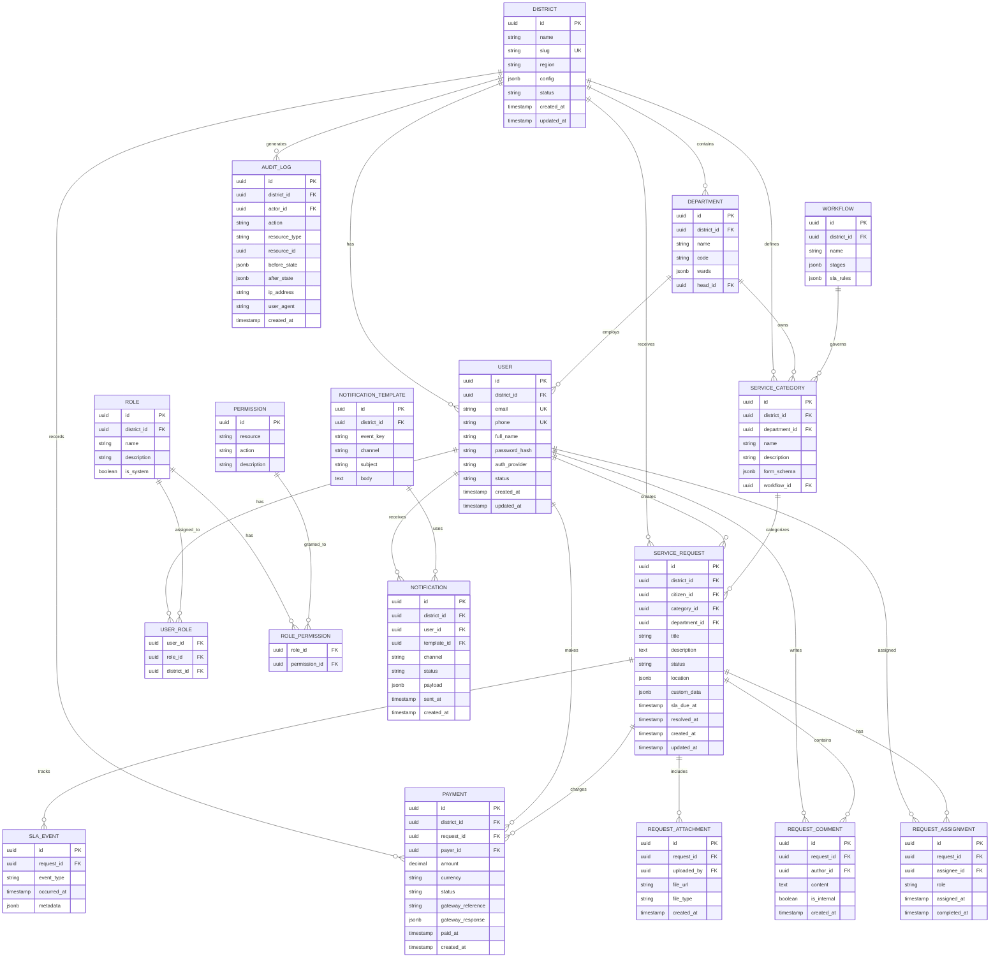

# District360 — Database Architecture

**Version:** 1.0  
**Status:** Draft for technical review  
**Audience:** Backend engineers, DBAs, architects

---

## 7. Database Architecture

### 7.1 Database Choice

District360 uses **PostgreSQL 16+** as the primary relational database. PostgreSQL provides:

- ACID compliance for transactional workflows.
- Native JSONB support for flexible form data.
- PostGIS extension for geospatial queries.
- Row-Level Security (RLS) for tenant isolation.
- Robust full-text search (optionally augmented by Elasticsearch in Phase 2).

### 7.2 Tenant Isolation Strategy

- **Shared database, tenant-aware schema.**
- Every tenant-scoped table includes `district_id UUID NOT NULL`.
- RLS policies enforce that users only access rows where `district_id` matches their tenant.
- Application services retrieve `district_id` from JWT claims and apply it to all queries.

### 7.3 Schema Organization

| Schema | Purpose |
|--------|---------|
| `public` | Shared lookup tables, migrations metadata |
| `tenant` | Tenant configuration and global admin data |
| `identity` | Users, roles, permissions, sessions |
| `service` | Service requests, workflows, SLAs |
| `payment` | Transactions, invoices, receipts |
| `notification` | Templates, delivery logs, preferences |
| `audit` | Immutable audit logs |

### 7.4 Scaling Strategy

- Read replicas for analytics and reporting workloads.
- Connection pooling via PgBouncer.
- Partitioning for large audit and notification tables by time range.
- Indexing on `district_id`, status, created_at, and geospatial columns.

---

## 8. ER Diagram

---

## 9. Table Descriptions

### 9.1 `district`

Stores each tenant. The `config` JSONB holds branding, locale, timezone, and feature flags.

### 9.2 `user`

Stores user accounts. Users are scoped to a single district. Authentication can be local, OAuth, or OTP-based.

### 9.3 `role` / `user_role` / `permission` / `role_permission`

RBAC model. Roles are tenant-specific but seeded from system templates. Permissions are global actions on resources.

### 9.4 `department`

Departments within a district. `wards` JSONB defines the wards/zones the department serves.

### 9.5 `service_category`

Categories of citizen services. Includes a JSONB `form_schema` for dynamic request forms and a reference to a workflow.

### 9.6 `workflow`

Defines status stages and SLA rules per category.

### 9.7 `service_request`

Core entity. Tracks citizen requests, status, location, custom form data, and SLA due date.

### 9.8 `request_assignment`

Links requests to officers or field workers, tracking assignment and completion.

### 9.9 `request_comment`

Threaded comments; `is_internal` separates staff notes from citizen-visible updates.

### 9.10 `request_attachment`

References uploaded files stored in object storage.

### 9.11 `sla_event`

Records SLA milestones and breaches for reporting.

### 9.12 `payment`

Records online payments linked to requests or general fees.

### 9.13 `notification` / `notification_template`

Message delivery tracking and tenant-customizable templates.

### 9.14 `audit_log`

Immutable record of all significant data changes.

---

## 10. Indexing Strategy

| Table | Indexes |
|-------|---------|
| `district` | `slug` (unique), `status` |
| `user` | `district_id + email`, `district_id + phone`, `status` |
| `service_request` | `district_id + status`, `district_id + created_at`, `district_id + category_id`, GIST on `location` |
| `request_assignment` | `request_id`, `assignee_id`, `assigned_at` |
| `payment` | `district_id + status`, `gateway_reference` |
| `notification` | `district_id + user_id + status`, `created_at` |
| `audit_log` | `district_id + created_at`, `resource_type + resource_id` |

---

## 11. Partitioning Strategy

- `audit_log`: Range partition by `created_at` (monthly).
- `notification`: Range partition by `created_at` (monthly).
- This improves query performance and simplifies archival of old records.

---

## 12. Backup & Recovery

- Daily automated snapshots with point-in-time recovery.
- Cross-region replication for disaster recovery.
- Quarterly restore drills.

---

## 13. Migration & Seeding

- Database migrations managed with Prisma Migrate or Flyway.
- Seed scripts create system permissions, default role templates, and sample workflows.
- New tenant provisioning applies tenant-specific seeds programmatically.
